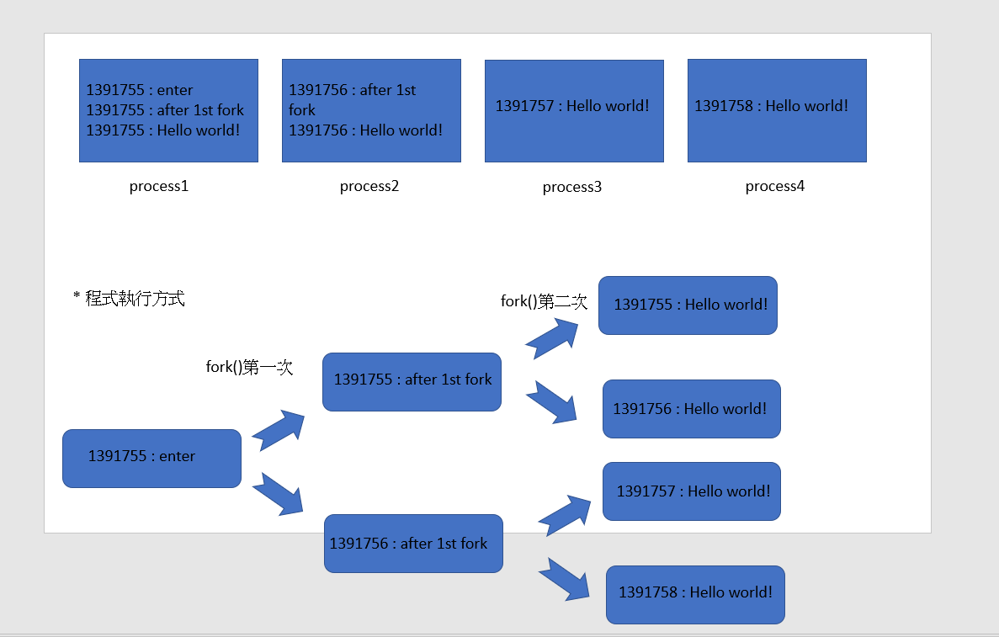

* Note:本次上課是從08-posix/01-basic/ 到 08-posix/05-myshell/
## 08-posix/01-basic/
### fork1.c
* gcc fork1.c -o fork1 來編譯
* ./fork1來執行
* 其中getpid就是得到該行程的識別碼，然後分別運用兩次fork()可以得到四筆資料
* fork1.c程式碼
```
#include <stdio.h> 
#include <sys/types.h> 
#include <unistd.h>

int main() { 
    fork(); // 一個行程分叉成父子兩個行程
    fork(); // 兩個行程又分別分叉出兩對父子，所以變成四個行程。
    printf("%-5d : Hello world!\n", getpid());
}
```
* fork1.c執行結果
```
root@localhost:~/sp/08-posix/03-fork/01-hello# ./fork1
1389211 : Hello world!
root@localhost:~/sp/08-posix/03-fork/01-hello# 1389213 : Hello world!
1389212 : Hello world!
1389214 : Hello world!
```
### fork2.c
* gcc fork2.c -o fork2來編譯
* ./fork1來執行
* fork2.c理解圖示


* fork2.c程式碼
```
#include <stdio.h> 
#include <sys/types.h> 
#include <unistd.h>

int main() { 
    printf("%-5d : enter\n", getpid());
    fork(); // 一個行程分叉成父子兩個行程
    printf("%-5d : after 1st fork\n", getpid());
    fork(); // 兩個行程又分別分叉出兩對父子，所以變成四個行程。
    printf("%-5d : Hello world!\n", getpid());
}
```
### fork3.c 只是在最後加上一個無窮迴圈
>* gcc fork3.c -o fork3 來編譯
>* 使用./fork3 & 來執行，就可以放到背景執行
>* 然後ps就可以看到現在的所有行程

## 08-posix/03-fork/03-exec
### execvp.c
>* 這個主要是做出linux中模仿ls -l 的功能
>* 執行結果
```
execvp():before
total 28
drwxr-xr-x 2 root root  4096 Mar 17 06:06 backup
-rwxr-xr-x 1 root root 16792 May 12 05:50 execvp
-rw-r--r-- 1 root root   176 Mar 17 06:06 execvp1.c
```

## 08-posix/03-fork/04-system
### system1.c
>* system() :將要執行的指令放入system
>* system1.c
```
#include <stdio.h>
#include <stdlib.h>

int main() {
  system("ls -l");
  printf("main end!\n");
}
```
>* 就會出現在linux中ls -l指令中的結果
```
-rw-r--r-- 1 root root   332 May 12 05:28 mysystem1.c
-rwxr-xr-x 1 root root 16744 May 12 06:13 system1
-rw-r--r-- 1 root root    99 Mar 17 06:06 system1.c
main end!
```
## 08-posix/04-fs/
### 01-echo/echo1.c
>* 補充:read,write是unistd中所用有的，非C語言的標準輸出入
>* 先用read去讀它，然後輸出兩次
>* write 中 2是標準錯誤，想要印出錯誤，會輸出到那裡
>* 程式碼
```
#include <stdio.h>
#include <unistd.h>
#define SMAX 128

int main() {
  char line[SMAX];
  int n = read(0, line, SMAX); // 從 0 (標準輸入 stdin:鍵盤) 讀入一行字 line
  line[n] = '\0';              // 設定字串結尾
  write(1, line, n);           // 將 line 輸出到 1 (標準輸出 stdout)
  write(2, line, n);           // 將 line 輸出到 2 (標準錯誤 stderr)
}
```
>* 運行結果
```
root@localhost:~/sp/08-posix/04-fs/01-echo# ./echo
hello world
hello world
hello world
```
### 02-fecho/fecho1.c
* 這段程式會產生b.txt
* 然後使用cat a.txt or b.txt可以得到裡面內容
