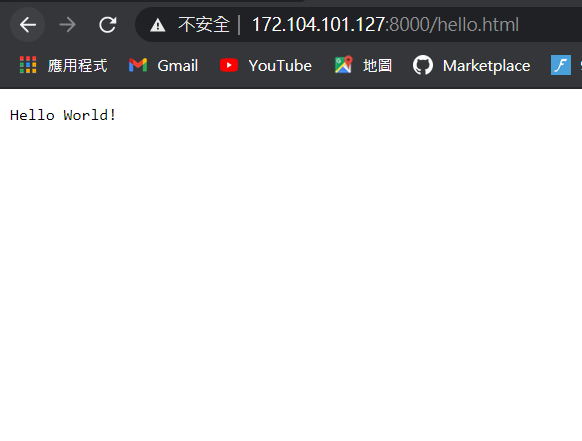
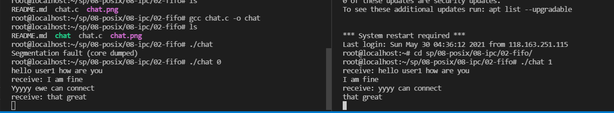

## Web Server
* 網頁伺服器就是回應請求給瀏覽器的那一端
* client
```
GET / HTTP/1.1
空行
```
* server
```
HTTP/1.1 200 OK
COntent-Length:12
空行
Hello World
```


### sp/08-posix/06-net/05-http
* 判斷可否連進去
* 其中net_init:網路初始化

* 先` ./htmlServer`讓伺服器啟動
```
Server started at port: 8080
```
* 再開另一個terminal `curl -v http://172.104.101.127:8080/hello.html`
>* 注意:前面172.104.101.127這是我linode 的ip，一般電腦上的虛擬機是`curl -v http://127.0.0.1:8080/hello.html`
* 如果想要設定port號和尋找net的定義，就在net.h中可以找到 
* 執行結果(因為這邊使用curl -v指令，所以是抓到整個網頁)
```
*   Trying 172.104.101.127:8080...
* TCP_NODELAY set
* Connected to 172.104.101.127 (172.104.101.127) port 8080 (#0)
> GET /hello.html HTTP/1.1
> Host: 172.104.101.127:8080
> User-Agent: curl/7.68.0
> Accept: */*
>
* Mark bundle as not supporting multiuse
< HTTP/1.1 200 OK
< Content-Type: text/html; charset=UTF-8
< Content-Length: 84
<
<html>
<body>
Hello!

<a href="https://tw.youtube.com/">YouTube</a>
</body>
* Connection #0 to host 172.104.101.127 left intact
```

* 假設要指定PORT在執行程式時
* 可以執行`./headPrintServer 8000`，就可以開啟那個指定PORT來RUN
* 以下為執行結果(在程式這端)
```
Server started at port: 8000
===========header=============
GET /hello.html HTTP/1.1
Host: 172.104.101.127:8000
Connection: keep-alive
Upgrade-Insecure-Requests: 1
User-Agent: Mozilla/5.0 (Windows NT 10.0; Win64; x64) AppleWebKit/537.36 (KHTML, like Gecko) Chrome/90.0.4430.212 Safari/537.36
Accept: text/html,application/xhtml+xml,application/xml;q=0.9,image/avif,image/webp,image/apng,*/*;q=0.8,application/signed-exchange;v=b3;q=0.9
Accept-Encoding: gzip, deflate
Accept-Language: zh-TW,zh;q=0.9,en-US;q=0.8,en;q=0.7


===========header=============
GET / HTTP/1.1
Host: 172.104.101.127:8000
Connection: keep-alive
Upgrade-Insecure-Requests: 1
User-Agent: Mozilla/5.0 (Windows NT 10.0; Win64; x64) AppleWebKit/537.36 (KHTML, like Gecko) Chrome/90.0.4430.212 Safari/537.36
Accept: text/html,application/xhtml+xml,application/xml;q=0.9,image/avif,image/webp,image/apng,*/*;q=0.8,application/signed-exchange;v=b3;q=0.9
Accept-Encoding: gzip, deflate
Accept-Language: zh-TW,zh;q=0.9,en-US;q=0.8,en;q=0.7


===========header=============
GET /favicon.ico HTTP/1.1
Host: 172.104.101.127:8000
Connection: keep-alive
User-Agent: Mozilla/5.0 (Windows NT 10.0; Win64; x64) AppleWebKit/537.36 (KHTML, like Gecko) Chrome/90.0.4430.212 Safari/537.36
Accept: image/avif,image/webp,image/apng,image/svg+xml,image/*,*/*;q=0.8
Referer: http://172.104.101.127:8000/hello.html
Accept-Encoding: gzip, deflate
Accept-Language: zh-TW,zh;q=0.9,en-US;q=0.8,en;q=0.7
```
* 在網頁上的執行結果

 
### sp/08-posix/07-nonblocking
* 在這裡面blocking1.c和nonblocking1.c中的差別是，blocking1.c會一直跑等到有東西才會換行。而nonblocking.c中是一直重複跑那個迴圈，所以是就算不按下任何東西還是會一直跑
* 這兩個一樣分別使用`gcc blocking1.c -o blocking1`和`gcc nonblocking1.c -o nonblocking1`來編譯，接者使用`./blocking1`和` ./nonblocking1`來執行就可以輕易看出兩者差別

### linux中的其他指令
* `pa -A | more`:將他便成可以一頁一頁讀出來(運用下鍵或是s鍵)
```
//實作結果
  PID TTY          TIME CMD
      1 ?        00:07:41 systemd
      2 ?        00:00:00 kthreadd
      3 ?        00:00:00 rcu_gp
      4 ?        00:00:00 rcu_par_gp
      6 ?        00:00:00 kworker/0:0H-kblockd
      9 ?        00:00:00 mm_percpu_wq
     10 ?        00:02:01 ksoftirqd/0
     11 ?        00:05:05 rcu_sched
     12 ?        00:00:32 migration/0
     13 ?        00:00:00 idle_inject/0
     14 ?        00:00:00 cpuhp/0
     15 ?        00:00:00 kdevtmpfs

...skipping 1 line
     17 ?        00:00:00 rcu_tasks_kthre
     18 ?        00:00:00 kauditd
     19 ?        00:00:24 khungtaskd
     20 ?        00:00:00 oom_reaper
     21 ?        00:00:00 writeback
     22 ?        00:00:00 kcompactd0
     23 ?        00:00:00 ksmd
     24 ?        00:00:18 khugepaged
     70 ?        00:00:00 kintegrityd
     71 ?        00:00:00 kblockd
     72 ?        00:00:00 blkcg_punt_bio
     73 ?        00:00:00 tpm_dev_wq
     74 ?        00:00:00 ata_sff
--More--
```
* `cat README.md | grep 1`:抓出所有包含1這個字元的特徵的值
```
//實作結果
-rw-r--r--  1 mac020  staff   282  5 25 10:00 README.md
-rwxr-xr-x  1 mac020  staff  8916  5 25 09:59 pipe0
-rw-r--r--  1 mac020  staff  1142  5 25 09:57 pipe0.c
-rw-r--r--  1 mac020  staff   146  3  3 10:11 pipe1.c
-rw-r--r--  1 mac020  staff   282  5 25 10:00 README.md
-rw-r--r--  1 mac020  staff     0  5 25 10:03 ls.out
-rwxr-xr-x  1 mac020  staff  8916  5 25 09:59 pipe0
-rw-r--r--  1 mac020  staff  1142  5 25 09:57 pipe0.c
-rw-r--r--  1 mac020  staff   146  3  3 10:11 pipe1.c
13086 ttys001    0:00.02 /bin/bash -l
17498 ttys002    0:00.01 /bin/bash -l
24191 ttys003    0:00.02 /bin/bash -l
      16      31     282
      16      31     282 README.md
```
* `wc`:計算指定檔案的換行數、字數與字元數
>* 補充:假設想要單純的換行數或字數或字元數可以在中間加入`-w,-l,-c`，例如`wc -w README.md`這種方式
```
root@localhost:~/sp/08-posix/09-pipe/00-shell# cat README.md | wc
     28     153    1008
root@localhost:~/sp/08-posix/09-pipe/00-shell# wc README.md
  28  153 1008 README.md
```
### sp/08-posix/09-pipe/02-popen/upper
* 這邊是指將小寫字轉成大寫字母
```
root@localhost:~/sp/08-posix/09-pipe/02-popen/upper# ./upperpipe
prompt> frw
FRW
prompt> Gutnen Morgen
GUTEN MORGEN
prompt>
[2]+  Stopped                 ./upperpipe
root@localhost:~/sp/08-posix/09-pipe/02-popen/upper# ./upper
ji
JI
Hi
[3]+  Stopped                 ./upper
```
### sp/08-posix/09-pipe/02-popen/upper
* 這是將小寫轉換成大寫
* 在upper.c中的`fflush(stdout);`是指刷新緩衝區，並把緩衝區的東西打印到標準輸出裝置上
* `fpin = popen("./upper", "r");`:這是執行upper，然後r是讀取，w代表寫入
```
root@localhost:~/sp/08-posix/09-pipe/02-popen/upper# ./upperpipe
prompt> frw
FRW
prompt> Gutnen Morgen
GUTEN MORGEN
prompt> 
[2]+  Stopped                 ./upperpipe
root@localhost:~/sp/08-posix/09-pipe/02-popen/upper# ./upper
ji
JI
Hi
[3]+  Stopped                 ./upper
```

### sp/08-posix/08-ipc/02-fifo
* 這是老師修改後的版本，兩邊可以相互溝通



