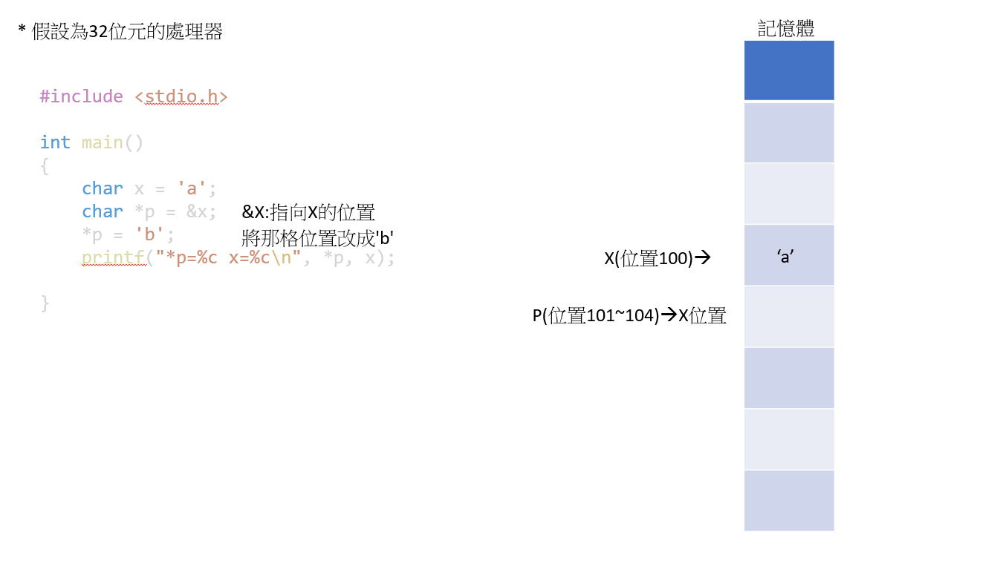
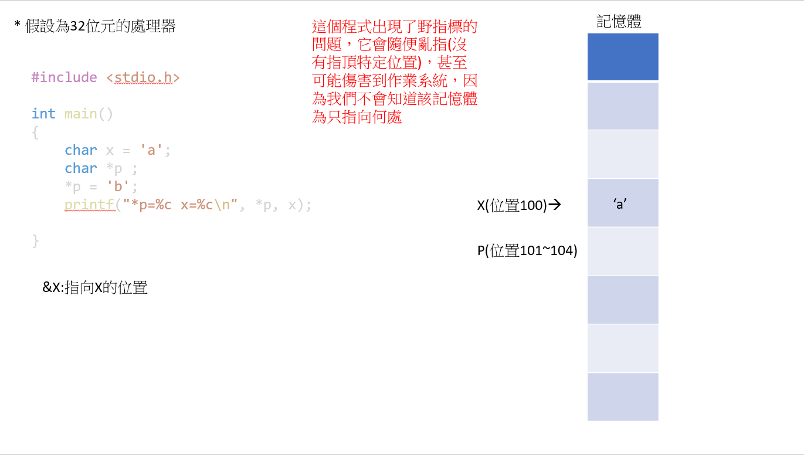

## 從lexer --> 編譯器(if/while...)
>* 02-lexer(其中lexer.c為主要程式，sum.c為測試用的)
* lexer : 變成一個個token(字串)，然後將其一個一個讀出來
* 指標複習:





* 編譯程式: gcc lexer.c -o lexer
* 執行程式: ./lexer sum.c
* 執行結果:  
```
#include "sum.h"

int main() {
  int t = sum(10);
  printf("sum(10)=%d\n", t);
}
token=#      
token=include
token="sum.h"
token=int    
token=main   
token=(
token=)
token={
token=int
token=t
token==
token=sum
token=(
token=10
token=)
token=;
token=printf
token=(
token="sum(10)=%d\n"
token=,
token=t
token=)
token=;
token=}
0:#
1:include
2:"sum.h"
3:int
4:main
5:(
6:)
7:{
8:int
9:t
10:=
11:sum
12:(
13:10
14:)
15:;
16:printf
17:(
18:"sum(10)=%d\n"
19:,
20:t
21:)
22:;
23:}
```
```
int readText(char *fileName, char *text, int size) {
  FILE *file = fopen(fileName, "r");
  int len = fread(text, 1, size, file);
  text[len] = '\0';
  fclose(file);
  return len;
}
// rw+:既可以讀取又可以寫入，如果當按不存在則新增
// r:只讀取
// w:創造一個空黨，如廣檔案存在，原本的會被清空
// w+:先清空，既可以讀又可以寫
// r+:既可讀又可以寫
// wb:2進位的讀檔
```

## 本週作業 if (位於我的HW\01\if)
### if
>* if是按照老師給的03b-compiler2來自己改寫出來的
>* 然後程式碼放在我HW\01\if資料夾中
* 程式碼:
>* 我只取IF()來做介紹
```
void IF() {
  int ifBigin = nextLabel();     //label1
  int ifMid = nextLabel();       //label2
  int ifEnd = nextLabel();       //label3
  emit("(L%d)\n",ifBigin);       //一開始給他標記
  skip("if");                    //略過if這個標記
  skip("(");                     //略過(這個標記
  int e= E();                    //處理裡面的符號
  emit("if not t%d goto L%d\n",e,ifMid); 
  skip(")");
  STMT();
  emit("goto L%d\n",ifEnd);
  emit("(L%d)\n", ifMid);
  if (isNext("else")) {          //如果有else的話就會進去這段程式
    skip("else");
    //emit("if L%d goto L%d\n",ifMid,ifEnd);
    STMT();
    emit("(L%d)\n",ifEnd);       //標示else結束
  }
}
```

>* 執行./compiler.c test/if.c 出來的結果(parse) ==> 可以對照if.c看會更明白
>* 以下執行結果，重要部分都有標記
```
============ parse =============
(L0)
t0 = a  
t1 = 3
t2 = t0 > t1         //判斷a有沒有大於3
if not t2 goto L1    //如果沒有就直接到L1那個標記那邊
t3 = 1               //如果進來，就繼續執行"t=1;"這個動作
t = t3               //"t=1"
goto L2              //有進去if的話在這邊就會直接跳到L2那邊，離開了這個block
(L1)                 //剛剛(if not t2 goto L1)如果跳到L1的話，就會順利進入else中
t4 = 2               //如果進來就會執行"t=2"這一段
t = t4
(L2)                 //有執行if結束，就會直接到L2
```
>* if.c中的程式
```
if (a>3) {
  t=1;
} else {
  t=2;
}
```

>* 我有在test中添加if2.c來測試else if是否會正確，看出此IF()成功，能順利解決else if的問題
>* 以下為其執行結果
```
============ parse =============
(L0)
t0 = a
t1 = 3
t2 = t0 > t1
if not t2 goto L1 //沒進第一個if會到L1
t3 = 1
t = t3
goto L2           //如果進到第一個if，則會直接跳出這個block
(L1)              //到L1後，接者往下執行
(L3)               
t4 = a
t5 = 0
t6 = t4 <= t5  
if not t6 goto L4  //沒進第二個else if會到L4
t7 = 2
t = t7
goto L5             //到L5後，接者往下執行           
(L4)                
t8 = 3
t = t8
(L5)
(L2)
```
>* if2.c
```
if (a>3) {
  t=1;
} else if(a<=0){
  t=2;
} else{
  t=3;
}

```


