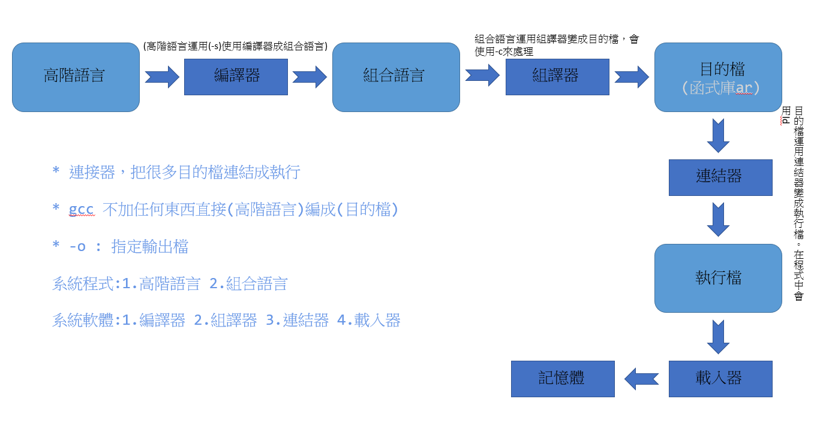
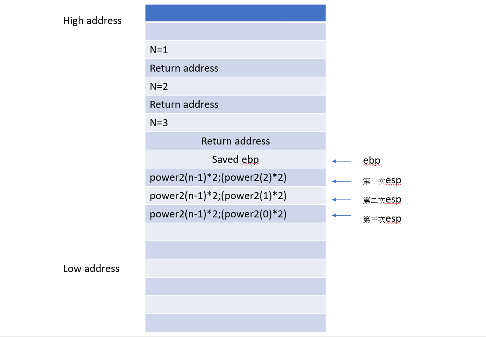

### 程式編譯，組譯，連結，載入的Memo



* 補充(專利介紹):
```
專利:20年(新穎，進步，可實行) ==> 就可以去申請
* 申請者:只需付專利費
* 使用者:需要付錢2
著作權:50年
商標:公司
```

### 堆疊段(這段位於記憶體中的某一小區域，堆積段也在記憶體中)
以下power2.c程式碼，主要做2的多少次方
```
#include<stdio.h>

int power2(int n){
    if(n==0) return 1;
    return power2(n-1)*2;
}

int main(){
    int p = power2(3);
    printf("p=%d\n",p);
}
```
>* 以下是上述程式碼在堆疊段中的表現狀況(區域變數和參數，還有返回位置和處吋位置及ebp)


* 註解
>* ESP:堆疊的最後一個(堆疊暫存器)
>* EBP:現在的存取點，組合語言在函式式呼叫時就要推EBP(框架暫存器)
>* ret只返回一層，所以要把ret這個返回點存到堆疊中

* 馮鈕曼架構

### 堆積段
>* 堆積段:malloc分配區域給想使用的人，然後用free來還區域(傳一個大小給它，傳回一個void(傳一個大小)的指標)
>* 在記憶體中分配我們所需要的大小，運用最佳匹配，最差匹配來分配記憶體


### sp/04-asm/02-gnu/03-fib/fib.s
* `gcc -fverbose-asm -S fib.c -o fib.s`
>* 會產生fib.s檔，可以看到它fib.c的組合語言在fib.s
>* movl:放到某位置
>* subl:相減
>* 所有的傳回值。都會放在eas中
```
L2:
	movl	8(%ebp), %eax	 # n, tmp93     //將ebp放入eax中
	subl	$1, %eax	 #, D.1493          //將eax-1
	movl	%eax, (%esp)	 # D.1493,
	call	_fib	 #
	movl	%eax, %ebx	 #, D.1493          //為甚麼要將eax放在ebx中，因為之後要相加
	movl	8(%ebp), %eax	 # n, tmp94
	subl	$2, %eax	 #, D.1493
	movl	%eax, (%esp)	 # D.1493,
	call	_fib	 #
	addl	%ebx, %eax	 # D.1493, D.1493
```
* X86會把eas視為傳回值
* 放到堆疊頂端再呼叫fib