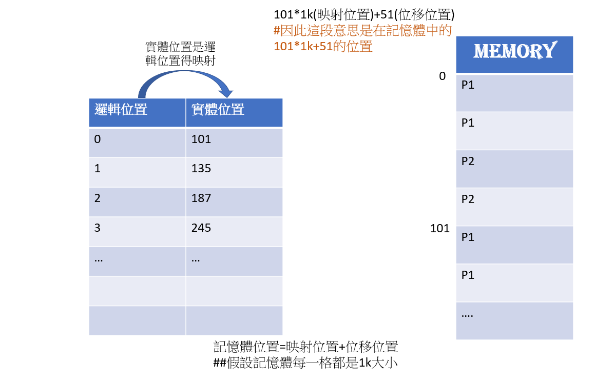

## 02-thread/race.c
* `$gcc race.c -o race .lpthread` 
* `./race`來執行
* 因為會出現race condition，所以需要程式員手動處理這個問題(至今遇到這些問題，只能有程序員手動處理這個問題)
* 為甚麼會出現這個問題呢?因為thread會同時執行C=C+1和C=C-1，以下組合語言對其解釋
```

C=C+1
@C
D=M+1
M=D

C=C-1
@C
D=M-1
M=D
```

## 02-thread/norace.c
* $gcc norace.c -o norace .lpthread 來執行
* ./norace
* 這段程式解決剛剛遇到的race condition的問題
```
pthread_mutex_lock(&mutex1); //類似紅綠燈，os會判，os會判斷此為紅燈還是綠燈

inc和dec會同時跑，可能會運用某次LOOP執行完的瞬間去奪過判斷
```

## 02-thread/deadlock.c
* 本程式會產生死結問題，因為B和A同時需要x和y，B先需y，A先需要x，但都是最後才關掉
* 接者只需做出題型模式(也就是先進後出就可以避免死結的問題A:x,y,uy,ux)
* `$gcc deadlock.c -o deadlock .lpthread` 
* `./deadlock`來執行
```
B lock y
A lock x


```

* 協同式多工:可以同時執行很多程式，但只要一個程式當掉就當掉

* 作業系統利用輸出入的空檔來切換，運用裝置本身具中斷訊號(中斷控制器)
* 多少核心電腦，能由多少人同時使用CPU，幾核心就有幾人
* 多行程(multiprocess)，就是deadlock&時可以放在背景執行，CPE一段時間後會先去跑其他的，跑完就繼續執行這個deadlock，這是時間中斷的方式

```
基本排成方法:
先到現做排成
最短工作優先排成
最短剩餘優先排成
優先權排成
循環分成排成:給時間中斷(時間是固定的)
```
* 運用`ps -A`:可以知道有多少排成 
## 行程 VS 執行緒
* Thread(執行緒)=>共用記憶體與相關資源，切換時只需保存暫存器，快速
* 行程:須保存分頁表(映射表)，也須保存暫存器等，較慢 
>* 底下圖片的實體位置就是表現映射表
>* 由101*1k(映射位置)+51(位移位置)


* 補充
>* 真實位置是=邏輯位置+base位置
>* 切換process時就要切換base


