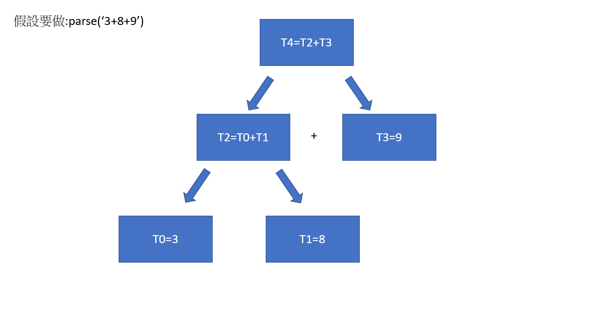

## compiler
>* STEP1: 需要先做語法(Syntax)上的處理,1.Lexer 2. Parser
>* STEP2: Semantic(型態檢查)語意
>* STEP3: Code Generation
>* STEP4: IR
>* STEP5: ASM
>* STEP6: Obj

### Syntax-Parser(Grammar)
03.compiler 執行程式
```
gcc genEnglish.c rlib.c -o genEnglish
```
// S = NP VP
// NP = DET(定詞) N
// VP = V NP
// N = dog | cat
// V = chase | eat (動詞種類)
// DET = a | the (定詞種類)

## exp0.c
>* 來源:程式碼為看老師的，我將我理解過程寫成筆記
>* 主旨:這段程式類似資料結構學過的樹狀結構，從最底層開始一層一層建上去，假設是3+5+9，會像以下圖示



>* exp0.c需要 gcc exp0.c -o exp0 先編譯成執行檔
* 接者，嘗試打./exp0 '3+8+9'會出現
```
Christina@LAPTOP-QPN2QOO8 MINGW64 ~/Documents/sp/sp/03-compiler/01-exp0 (master)
$ ./exp0 '3+8+9'
argv[0]=C:\Users\Christina\Documents\sp\sp\03-compiler\01-exp0\exp0.exe argv[1]=3+8+9
=== EBNF Grammar =====
E=F ([+-] F)*
F=Number | '(' E ')'
==== parse:3+8+9 ========
t0=3
t1=8
t2=t0+t1
t3=9
t4=t2+t3
```
* 程式碼介紹(省略一些抓部分說明):
>*  1.在這段中argc = 它的數量 argv = 我們打的數量
 例如:./egp0 '3+5' ==> argc=2,argv[0]=./exp0,argv[1]='3+5'
```
int main(int argc, char * argv[]) { 
  printf("argv[0]=%s argv[1]=%s\n", argv[0], argv[1]);
  printf("=== EBNF Grammar =====\n");
  printf("E=F ([+-] F)*\n");
  printf("F=Number | '(' E ')'\n");
  printf("==== parse:%s ========\n", argv[1]);
  parse(argv[1]);
}
```
>* 2.接者判斷是否為一個十進位的數字，如果是的話就print出
```
int F() {
  int f;
  char c = ch();
  if (isdigit(c)) {
    next(); // skip c
    f = nextTemp();
    printf("t%d=%c\n", f, c);
  } else if (c=='(') { // '(' E ')'
    next();
    f = E();
    assert(ch()==')');
    next();
  } else {
    error("F = (E) | Number fail!");
  }
  return f; 
}
```
>* 判斷後面是否為+ or-
```
int E() {
  int i1 = F();
  while (isNext("+-")) { //判斷是否後面為+or-
    char op=next(); //假設3+5，第一次:3，接者是+
    int i2 = F();
    int i = nextTemp();
    printf("t%d=t%d%ct%d\n", i, i1, op, i2);
    i1 = i;
  }
  return i1;
}
```

## exp0hack.c
>* 主旨:這段程式碼類似exp0.c，只是增加了組合語言，然後C語言在輸出時便成了註解的形式
>* 要執行時一樣先需要編譯:gcc exp0hack.c -o exp0hack
>* 接著，./exp0hack '3+8+9'，會出現
```
=== EBNF Grammar =====
E=F ([+-] F)*
F=Number | '(' E ')'
==== parse:3+8+9 ========
# t0=3
@3
D=A
@t0
M=D
# t1=8
@8
D=A
@t1
M=D
# t2=t0+t1
@t0
D=M
@t1
D=D+M
@t2
M=D
# t3=9
@9
D=A
@t3
M=D
# t4=t2+t3
@t2
D=M
@t3
D=D+M
@t4
M=D
```
* 程式碼的部分(我主要列出組合語言的部分，其他都是exp0.c類似)
>* 此部分為轉為組合語言的部分
>* 單純處理數字成符號的部分// ex : t1=3
```
void genOp1(int i, char c) {
  printf("# t%d=%c\n", i, c);
  // t1=3 轉成 @3; D=A; @t1; M=D
  printf("@%c\n", c);
  printf("D=A\n");
  printf("@t%d\n", i);
  printf("M=D\n");
}
```
>* 處理需要將兩變數，相加變成組合語言的部分// ex : t2 = t0+t1
```
void genOp2(int i, int i1, char op, int i2) {
  printf("# t%d=t%d%ct%d\n", i, i1, op, i2);
  // t0=t1+t2 轉成 @t1; D=M; @t2; D=D+M; @t0; M=D;
  printf("@t%d\n", i1);
  printf("D=M\n");
  printf("@t%d\n", i2);
  printf("D=D%cM\n", op);
  printf("@t%d\n", i);
  printf("M=D\n");
}
```


